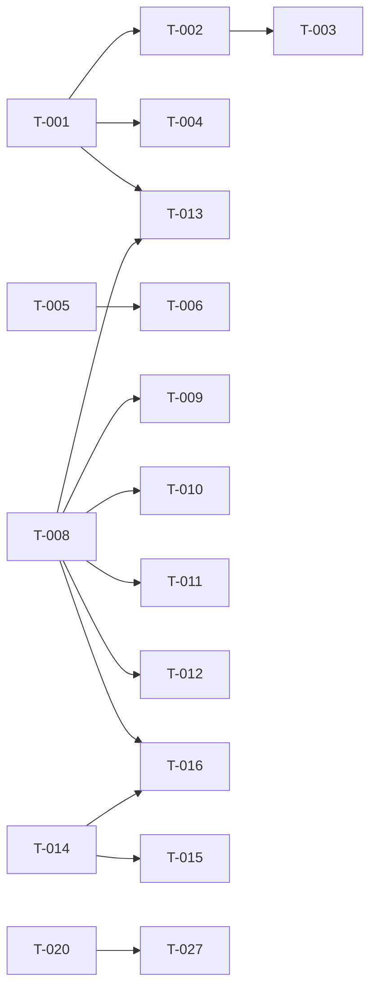

# Build Site

28 tasks across 3 tiers from 5 kits.

**Note:** cavekit-issue-category-grouping (R1-R4) is fully implemented (T-001..T-004 DONE). Those tasks are listed for traceability but will not be re-executed.

---

## Tier 0 -- No Dependencies (Start Here)

| Task | Title | Cavekit | Requirement | Effort |
|------|-------|---------|-------------|--------|
| T-001 | Implement category bucket logic | cavekit-issue-category-grouping | R1 | L |
| T-002 | Render grouped sections with headers | cavekit-issue-category-grouping | R2 | M |
| T-004 | Verify preserved functionality | cavekit-issue-category-grouping | R4 | L |
| T-005 | Add Score column to IssuesTab | cavekit-issues-score | R1 | M |
| T-008 | Create shared issue-type utility | cavekit-dynamic-issue-types | R1 | M |
| T-014 | Add throughput grouping toggle UI | cavekit-throughput-grouping | R1 | S |
| T-020 | Add n8n Base URL setting | cavekit-settings-audit | R1 | M |
| T-024 | Fix Jira Base URL propagation | cavekit-settings-audit | R2 | M |

## Tier 1 -- Depends on Tier 0

| Task | Title | Cavekit | Requirement | blockedBy | Effort |
|------|-------|---------|-------------|-----------|--------|
| T-003 | Add collapse/expand toggle | cavekit-issue-category-grouping | R3 | T-002 | M |
| T-006 | Add Score column sorting | cavekit-issues-score | R2 | T-005 | M |
| T-009 | Refactor TypeBadge to use shared utility | cavekit-dynamic-issue-types | R2 | T-008 | S |
| T-010 | Refactor ThroughputChart colors | cavekit-dynamic-issue-types | R3 | T-008 | S |
| T-011 | Refactor form dropdowns to dynamic types | cavekit-dynamic-issue-types | R4 | T-008 | M |
| T-012 | Refactor settings checkboxes to dynamic types | cavekit-dynamic-issue-types | R5 | T-008 | M |
| T-015 | Implement by-assignee breakdown | cavekit-throughput-grouping | R2 | T-014 | M |
| T-027 | Group settings page into sections | cavekit-settings-audit | R3 | T-020 | M |

## Tier 2 -- Depends on Tier 1

| Task | Title | Cavekit | Requirement | blockedBy | Effort |
|------|-------|---------|-------------|-----------|--------|
| T-013 | Dynamic category grouping for new types | cavekit-dynamic-issue-types | R6 | T-008, T-001 | S |
| T-016 | Refactor by-type breakdown to use shared utility | cavekit-throughput-grouping | R3 | T-014, T-008 | S |

---

## Summary

| Tier | Tasks | S | M | L |
|------|-------|---|---|---|
| 0 | 8 | 1 | 5 | 2 |
| 1 | 8 | 2 | 6 | 0 |
| 2 | 2 | 2 | 0 | 0 |
| **Total** | **18** | **5** | **11** | **2** |

**Total: 18 tasks, 3 tiers** (4 tasks already DONE from issue-category-grouping)

---

## Task Details

### T-001: Implement category bucket logic [DONE]
**Cavekit Requirement:** issue-category-grouping/R1
**Acceptance Criteria Mapped:** R1-AC1 through R1-AC11
**blockedBy:** none
**Effort:** L
**Status:** DONE -- `groupByCategory()`, `CATEGORY_MAP`, `CATEGORY_ORDER` implemented in `src/components/IssuesTab.tsx`

---

### T-002: Render grouped sections with headers [DONE]
**Cavekit Requirement:** issue-category-grouping/R2
**Acceptance Criteria Mapped:** R2-AC1, R2-AC2
**blockedBy:** T-001
**Effort:** M
**Status:** DONE -- Category header rows with name + count; empty categories hidden

---

### T-003: Add collapse/expand toggle [DONE]
**Cavekit Requirement:** issue-category-grouping/R3
**Acceptance Criteria Mapped:** R3-AC1, R3-AC2, R3-AC3, R3-AC4
**blockedBy:** T-002
**Effort:** M
**Status:** DONE -- `collapsedCategories: Set<string>` state; chevron indicators; resets on remount

---

### T-004: Verify preserved functionality [DONE]
**Cavekit Requirement:** issue-category-grouping/R4
**Acceptance Criteria Mapped:** R4-AC1, R4-AC2, R4-AC3, R4-AC4
**blockedBy:** T-001
**Effort:** L
**Status:** DONE -- All columns, footer total, CRUD, loading/error/empty states verified

---

### T-005: Add Score column to IssuesTab
**Cavekit Requirement:** issues-score/R1
**Acceptance Criteria Mapped:** R1-AC1, R1-AC2, R1-AC3, R1-AC4, R1-AC5, R1-AC6
**blockedBy:** none
**Effort:** M
**Description:**
Add a "Score" column to the issues table in `src/components/IssuesTab.tsx`.

1. Extend `JiraIssueShort` in `src/types.ts` with optional fields: `rice_score?: number | null`, `bug_score?: number | null`, `td_roi?: number | null`.
2. Create a helper function `getScore(issue)` that returns `{ value: number; type: 'rice' | 'bug' | 'techdebt' } | null`:
   - Check `rice_score` first, then `bug_score`, then `td_roi` -- first non-null wins.
3. Add a `<th>` for "Score" in the table header (after Priority, before the edit action column).
4. Add a `<td>` that displays the numeric value alongside a colored badge:
   - RICE: blue (`bg-blue-50 text-blue-700`)
   - Bug: red (`bg-red-50 text-red-700`)
   - TechDebt: yellow (`bg-amber-50 text-amber-700`)
5. If all three fields are null, render an empty `<td>`.
6. Update `<colgroup>` to accommodate the new column (7 columns total).

**Files:** `src/types.ts`, `src/components/IssuesTab.tsx`
**Test Strategy:** Load issues with varying score fields. Verify correct badge color. Verify null scores show empty cell. Verify column header visible.

---

### T-006: Add Score column sorting
**Cavekit Requirement:** issues-score/R2
**Acceptance Criteria Mapped:** R2-AC1, R2-AC2, R2-AC3, R2-AC4, R2-AC5
**blockedBy:** T-005
**Effort:** M
**Description:**
Make the Score column header clickable to toggle sort.

1. Add sort state to `IssuesTab`: `scoreSortDir: 'desc' | 'asc' | null` (null = no sort active).
2. On first click, set `scoreSortDir = 'desc'`. On subsequent clicks, toggle between `asc` and `desc`.
3. Sort the issues array (before grouping) by the computed score value. Null scores always sort last regardless of direction.
4. Add a visual indicator (arrow) on the Score header to show current sort direction.
5. When score sort is active, apply it before `groupByCategory` -- categories still group correctly, but issues within each category are sorted by score.

**Files:** `src/components/IssuesTab.tsx`
**Test Strategy:** Click Score header, verify descending sort. Click again, verify ascending. Verify null-scored issues appear at bottom in both directions. Verify direction toggles on subsequent clicks.

---

### T-008: Create shared issue-type utility
**Cavekit Requirement:** dynamic-issue-types/R1
**Acceptance Criteria Mapped:** R1-AC1, R1-AC2, R1-AC3, R1-AC4
**blockedBy:** none
**Effort:** M
**Description:**
Create `src/lib/issueTypes.ts` with a shared utility for dynamic issue types and colors.

1. Define a deterministic color palette (array of 12+ distinct Tailwind-compatible hex colors):
   ```
   const PALETTE = ['#10b981', '#ef4444', '#f59e0b', '#3b82f6', '#8b5cf6', '#ec4899', '#14b8a6', '#f97316', '#06b6d4', '#84cc16', '#6366f1', '#d946ef'];
   ```
2. Export `function getUniqueTypes(issues: Array<{ issuetype?: string; type?: string; issueType?: string; issue_type?: string }>): string[]` -- extracts unique type strings from any issue collection (handles the different field names used across `JiraIssueShort`, `ThroughputIssueRaw`, `RiceIssue`).
3. Export `function getTypeColor(typeName: string): string` -- deterministic hash of type name to palette index. Same type name always returns same color.
4. Export `function getTypeBadgeClasses(typeName: string): { bg: string; text: string; border: string }` -- returns Tailwind classes derived from the type color.
5. Remove `ISSUE_TYPES` arrays from `src/components/Settings.tsx` (line 11), `src/components/CreateIssueForm.tsx` (line 15), and `src/components/IssueFormFields.tsx` (line 187).

**Files:** `src/lib/issueTypes.ts` (new), `src/components/Settings.tsx`, `src/components/CreateIssueForm.tsx`, `src/components/IssueFormFields.tsx`
**Test Strategy:** Unit test `getTypeColor` returns same color for same input across calls. Unit test `getUniqueTypes` with mixed issue objects. Verify no `ISSUE_TYPES` const remains in Settings, CreateIssueForm, or IssueFormFields. Build check passes.

---

### T-009: Refactor TypeBadge to use shared utility
**Cavekit Requirement:** dynamic-issue-types/R2
**Acceptance Criteria Mapped:** R2-AC1, R2-AC2, R2-AC3
**blockedBy:** T-008
**Effort:** S
**Description:**
Refactor `TypeBadge` in `src/components/Badges.tsx` to remove the hardcoded if/else chain.

1. Import `getTypeBadgeClasses` from `src/lib/issueTypes.ts`.
2. Replace the `if (type === 'User Story') ... else if (type === 'Ошибка' || type === 'Bug') ...` chain with a single call to `getTypeBadgeClasses(type)`.
3. Keep the icon logic or simplify to a generic icon for all types (the kit does not require per-type icons, only consistent colors).
4. The badge must render for any arbitrary type string -- no conditional logic that would fail on unknown types.

**Files:** `src/components/Badges.tsx`
**Test Strategy:** Render TypeBadge with known types (User Story, Bug, Техдолг) and an unknown type ("NewType"). Verify all render with consistent colors, no crashes.

---

### T-010: Refactor ThroughputChart colors
**Cavekit Requirement:** dynamic-issue-types/R3
**Acceptance Criteria Mapped:** R3-AC1, R3-AC2
**blockedBy:** T-008
**Effort:** S
**Description:**
Replace the hardcoded `TYPE_COLORS` map and `typeColor()` function in `src/components/Charts.tsx` (lines 117-124).

1. Import `getTypeColor` from `src/lib/issueTypes.ts`.
2. Delete `TYPE_COLORS`, `DEFAULT_TYPE_COLOR`, and the `typeColor()` function.
3. Replace `typeColor(t)` calls (lines 143-144) with `getTypeColor(t)`.

**Files:** `src/components/Charts.tsx`
**Test Strategy:** Load throughput data with known and unknown issue types. Verify chart renders with colors for all types. Verify no `TYPE_COLORS` constant remains.

---

### T-011: Refactor form dropdowns to dynamic types
**Cavekit Requirement:** dynamic-issue-types/R4
**Acceptance Criteria Mapped:** R4-AC1, R4-AC2, R4-AC3
**blockedBy:** T-008
**Effort:** M
**Description:**
Make `IssueTypeSelect` in `src/components/IssueFormFields.tsx` and `CreateIssueForm.tsx` populate from fetched data.

1. `IssueTypeSelect` component: change its props to accept `availableTypes: string[]` instead of using the hardcoded `ISSUE_TYPES` array.
2. In `CreateIssueForm.tsx`: remove local `ISSUE_TYPES` const (line 15). Accept `availableTypes: string[]` as a prop and pass it to `IssueTypeSelect` and the AI generator type selector.
3. In `EditIssueForm.tsx`: similarly accept and pass `availableTypes`.
4. In `IssuesTab.tsx`: compute `availableTypes` using `getUniqueTypes(issues)` from the shared utility and pass down to create/edit forms.
5. In `App.tsx` or wherever forms are rendered: ensure the fetched issues collection feeds the type list.

**Files:** `src/components/IssueFormFields.tsx`, `src/components/CreateIssueForm.tsx`, `src/components/EditIssueForm.tsx`, `src/components/IssuesTab.tsx`
**Test Strategy:** Load issues with various types. Open create form, verify dropdown shows all types from data. Add a new type via API, reload, verify it appears in dropdown without code changes.

---

### T-012: Refactor settings checkboxes to dynamic types
**Cavekit Requirement:** dynamic-issue-types/R5
**Acceptance Criteria Mapped:** R5-AC1, R5-AC2, R5-AC3
**blockedBy:** T-008
**Effort:** M
**Description:**
Replace the hardcoded `ISSUE_TYPES` in `src/components/Settings.tsx` (line 11) with dynamic types.

1. Remove `const ISSUE_TYPES = ['User Story', 'Задача', 'Ошибка', 'Техдолг'];` from Settings.tsx.
2. Add a prop `availableTypes?: string[]` to Settings.
3. Use `availableTypes` for rendering the checkboxes. If `availableTypes` is empty or undefined, fall back to `settings.issueTypes` (already selected types) so the UI doesn't break before data loads.
4. In `App.tsx`: pass the known types from fetched data to Settings. This may require lifting the known types from the IssuesTab or fetching them at App level. Determine the best approach:
   - Option A: Store `knownTypes` in App state, populated from any fetch (metrics, issues, rice).
   - Option B: Derive from `settings.issueTypes` union with any fetched data.

**Files:** `src/components/Settings.tsx`, `src/App.tsx`
**Test Strategy:** Load data with types including one not in the old hardcoded list. Verify its checkbox appears in settings. Verify no hardcoded type array in Settings.tsx.

---

### T-013: Dynamic category grouping for new types
**Cavekit Requirement:** dynamic-issue-types/R6
**Acceptance Criteria Mapped:** R6-AC1, R6-AC2, R6-AC3
**blockedBy:** T-008, T-001
**Effort:** S
**Description:**
Verify and ensure that `groupByCategory()` in `IssuesTab.tsx` handles dynamic types correctly.

1. The existing `CATEGORY_MAP` already sends unknown types to "Прочее" via the fallback (`CATEGORY_MAP[issue.issuetype] ?? 'Прочее'`). This satisfies R6-AC2.
2. Verify that new types from the API that aren't in `CATEGORY_MAP` appear in the "Прочее" group and are visible in the table.
3. Ensure `CATEGORY_MAP` is not used as a filter that would exclude unknown types -- confirmed: it is only used for bucket assignment, not filtering.
4. No code change is expected unless verification reveals a bug.

**Files:** `src/components/IssuesTab.tsx` (verification only)
**Test Strategy:** Inject an issue with type "NewCustomType" into the data. Verify it appears in the "Прочее" group. Verify no hardcoded type list prevents it from rendering.

---

### T-014: Add throughput grouping toggle UI
**Cavekit Requirement:** throughput-grouping/R1
**Acceptance Criteria Mapped:** R1-AC1, R1-AC2, R1-AC3, R1-AC4, R1-AC5
**blockedBy:** none
**Effort:** S
**Description:**
Add toggle pills above the ThroughputChart in `src/components/Charts.tsx`.

1. Add a state variable `groupMode: 'byType' | 'byAssignee'` with default `'byType'` to the `ThroughputChart` component (or lift to parent if needed for data fetching).
2. Render two pill buttons above the chart canvas:
   - "По типу задач" (active when `groupMode === 'byType'`)
   - "По исполнителю" (active when `groupMode === 'byAssignee'`)
3. Style active pill with `bg-donezo-dark text-white` and inactive with `bg-gray-100 text-gray-600`.
4. On click, set `groupMode` -- the chart re-renders immediately via the existing `useEffect` dependency.
5. For now, both modes render the same by-type data (by-assignee data handling comes in T-015).

**Files:** `src/components/Charts.tsx`
**Test Strategy:** Verify two buttons visible above chart. Verify active button visually distinct. Verify default is "По типу задач". Verify clicking switches active state.

---

### T-015: Implement by-assignee breakdown
**Cavekit Requirement:** throughput-grouping/R2
**Acceptance Criteria Mapped:** R2-AC1, R2-AC2, R2-AC3, R2-AC4, R2-AC5
**blockedBy:** T-014
**Effort:** M
**Description:**
Add by-assignee stacking mode to the ThroughputChart.

1. Extend `ThroughputIssueRaw` in `src/types.ts` with `assignee?: string | null`.
2. Extend `ThroughputWeek` in `src/types.ts` with `byAssignee?: Record<string, number>`.
3. In `src/lib/metrics.ts` (`buildThroughputWeeksFromRaw`): when building weekly buckets, also aggregate by `assignee` field. Map null/empty assignee to "Не назначен".
4. In `ThroughputChart`: when `groupMode === 'byAssignee'`, use `week.byAssignee` instead of `week.byType` for dataset construction.
5. Assign distinct colors per assignee using `getTypeColor` from the shared utility (it works on any string, not just type names).
6. Legend shows assignee display names.

**Files:** `src/types.ts`, `src/lib/metrics.ts`, `src/components/Charts.tsx`
**Test Strategy:** Load throughput data with assignee info. Switch to "По исполнителю". Verify one stacked segment per unique assignee. Verify null assignee shows as "Не назначен". Verify legend shows names.

---

### T-016: Refactor by-type breakdown to use shared utility
**Cavekit Requirement:** throughput-grouping/R3
**Acceptance Criteria Mapped:** R3-AC1, R3-AC2
**blockedBy:** T-014, T-008
**Effort:** S
**Description:**
Ensure the by-type mode in ThroughputChart uses the shared dynamic color utility.

1. This should already be done by T-010 (which replaces `TYPE_COLORS` with `getTypeColor`).
2. Verify that the by-type mode stacks by issue type with the same behavior as before.
3. Confirm colors come from `getTypeColor` (shared utility) rather than any local map.

**Files:** `src/components/Charts.tsx` (verification, minimal change if T-010 is complete)
**Test Strategy:** Load throughput data in by-type mode. Verify stacking works. Verify colors are consistent with other components using the shared utility.

---

### T-020: Add n8n Base URL setting
**Cavekit Requirement:** settings-audit/R1
**Acceptance Criteria Mapped:** R1-AC1, R1-AC2, R1-AC3, R1-AC4, R1-AC5
**blockedBy:** none
**Effort:** M
**Description:**
Add a configurable n8n Base URL to settings and wire it through API calls.

1. Add `n8nBaseUrl?: string` to `Settings` interface in `src/types.ts`.
2. Add an "n8n Base URL" input field in `src/components/Settings.tsx` (next to the existing Jira Base URL field).
3. Persist via the existing `useLocalStorage` mechanism (it serializes the full `Settings` object).
4. Refactor `jiraUrl()` in `src/lib/jiraApi.ts`:
   - Currently it uses `new URL(webhookUrl).origin` in prod and relative paths in dev.
   - Change all jiraApi functions to accept `n8nBaseUrl` parameter (or pass it through a context/config).
   - In prod: use `n8nBaseUrl + path` (e.g., `n8nBaseUrl + '/webhook/jira/issues'`).
   - In dev: continue using relative paths for Vite proxy.
5. Similarly refactor `riceUrl()` in `src/lib/riceApi.ts`.
6. Update call sites in `IssuesTab.tsx`, `RiceSection.tsx`, and `App.tsx` to pass `n8nBaseUrl`.

**Files:** `src/types.ts`, `src/components/Settings.tsx`, `src/lib/jiraApi.ts`, `src/lib/riceApi.ts`, `src/components/IssuesTab.tsx`, `src/components/RiceSection.tsx`, `src/App.tsx`
**Test Strategy:** Set n8n Base URL in settings. Verify API calls use the new base URL. Change it, verify subsequent calls use the updated value. Verify persistence across page reloads.

---

### T-024: Fix Jira Base URL propagation
**Cavekit Requirement:** settings-audit/R2
**Acceptance Criteria Mapped:** R2-AC1, R2-AC2, R2-AC3, R2-AC4
**blockedBy:** none
**Effort:** M
**Description:**
Remove hardcoded `JIRA_BASE` constants from three components and replace with `jiraBaseUrl` from settings.

1. **IssuesTable.tsx** (line 6): Remove `const JIRA_BASE = 'https://jira.tochka.com/browse'`. Add `jiraBaseUrl: string` to `Props` interface. Replace `JIRA_BASE` usage in template (line 73) with `jiraBaseUrl`. Update call site in `App.tsx` to pass `settings.jiraBaseUrl`.
2. **AgingWIP.tsx** (line 10): Same pattern. Add `jiraBaseUrl: string` to props. Remove constant. Replace usage at line 199. Update call site in `App.tsx`.
3. **RiceSection.tsx** (line 6): Same pattern. Add `jiraBaseUrl: string` to props. Remove constant. Replace usage at line 180. Update call site in `App.tsx`.

**Files:** `src/components/IssuesTable.tsx`, `src/components/AgingWIP.tsx`, `src/components/RiceSection.tsx`, `src/App.tsx`
**Test Strategy:** Change Jira Base URL in settings. Navigate to metrics tab -- verify IssuesTable and AgingWIP links use new URL. Navigate to Scoring tab -- verify RiceSection links use new URL. Grep for `JIRA_BASE` constant -- should return 0 results.

---

### T-027: Group settings page into sections
**Cavekit Requirement:** settings-audit/R3
**Acceptance Criteria Mapped:** R3-AC1, R3-AC2, R3-AC3, R3-AC4, R3-AC5
**blockedBy:** T-020
**Effort:** M
**Description:**
Organize the Settings component into three visually distinct groups.

1. **Group 1: "Вебхуки"** -- Contains `webhookUrl` and `throughputWebhookUrl` fields.
2. **Group 2: "URL-адреса"** -- Contains `n8nBaseUrl` (from T-020) and `jiraBaseUrl` fields.
3. **Group 3: "Фильтрация"** -- Contains mode selector, project key / custom JQL, and issue type filter checkboxes.
4. Each group gets a visible heading (`<h3>` or styled `<div>`) with the group name.
5. Add visual separation between groups (e.g., `border-b border-gray-100 pb-4 mb-4` or similar).
6. The mode toggle (Стандартный / Свой JQL) stays in the header area or moves into Group 3.

**Files:** `src/components/Settings.tsx`
**Test Strategy:** Visual inspection: verify three labeled groups visible. Verify correct fields in each group. Verify each group has a heading.

---

## Coverage Matrix

### cavekit-issue-category-grouping

| Req | Criterion | Task(s) | Status |
|-----|-----------|---------|--------|
| R1 | `User Story` -> "User Story" category | T-001 | DONE |
| R1 | `Задача` -> "Задача" category | T-001 | DONE |
| R1 | `Sub-task` -> "Задача" category | T-001 | DONE |
| R1 | `Подзадача` -> "Задача" category | T-001 | DONE |
| R1 | `Ошибка` -> "Ошибки" category | T-001 | DONE |
| R1 | `Bug` -> "Ошибки" category | T-001 | DONE |
| R1 | `Техдолг` -> "Техдолг" category | T-001 | DONE |
| R1 | `Tech Debt` -> "Техдолг" category | T-001 | DONE |
| R1 | Any other type -> "Прочее" category | T-001 | DONE |
| R1 | No issue in more than one category | T-001 | DONE |
| R1 | Categories render in fixed order | T-001 | DONE |
| R2 | Header visible with count | T-002 | DONE |
| R2 | Zero-count categories not rendered | T-002 | DONE |
| R3 | Expanded on init | T-003 | DONE |
| R3 | Toggle works | T-003 | DONE |
| R3 | Independent per section | T-003 | DONE |
| R3 | Resets on unmount | T-003 | DONE |
| R4 | All columns present | T-004 | DONE |
| R4 | Footer total correct | T-004 | DONE |
| R4 | CRUD panel works | T-004 | DONE |
| R4 | Loading/error/empty states shown | T-004 | DONE |

### cavekit-issues-score

| Req | Criterion | Task(s) | Status |
|-----|-----------|---------|--------|
| R1 | "Score" column visible in issues table | T-005 | PLANNED |
| R1 | Score = first non-null among rice_score, bug_score, td_roi | T-005 | PLANNED |
| R1 | Score type determined by source field | T-005 | PLANNED |
| R1 | Displayed as numeric value + colored badge | T-005 | PLANNED |
| R1 | Badge blue for RICE, red for Bug, yellow for TechDebt | T-005 | PLANNED |
| R1 | Null score -> empty cell, no badge | T-005 | PLANNED |
| R2 | Clicking header toggles sort | T-006 | PLANNED |
| R2 | Default sort on first click is descending | T-006 | PLANNED |
| R2 | Null scores appear last when sorted ascending | T-006 | PLANNED |
| R2 | Null scores appear last when sorted descending | T-006 | PLANNED |
| R2 | Direction toggles on subsequent clicks | T-006 | PLANNED |

### cavekit-dynamic-issue-types

| Req | Criterion | Task(s) | Status |
|-----|-----------|---------|--------|
| R1 | No hardcoded ISSUE_TYPES arrays in settings/create/field components | T-008 | PLANNED |
| R1 | Shared utility exists: issues -> unique type set | T-008 | PLANNED |
| R1 | Utility assigns deterministic color per type name | T-008 | PLANNED |
| R1 | New type in upstream -> appears in all UI without code change | T-008 | PLANNED |
| R2 | TypeBadge renders for any arbitrary type string | T-009 | PLANNED |
| R2 | Colors sourced from shared utility, not hardcoded if/else | T-009 | PLANNED |
| R2 | Consistent color per type across all renders | T-009 | PLANNED |
| R3 | Chart renders correct colors for all types including unknown | T-010 | PLANNED |
| R3 | Colors sourced from shared utility | T-010 | PLANNED |
| R4 | Dropdowns show all types from fetched data | T-011 | PLANNED |
| R4 | New types appear without code changes | T-011 | PLANNED |
| R4 | No hardcoded type options in dropdowns | T-011 | PLANNED |
| R5 | Checkboxes for all types in fetched data | T-012 | PLANNED |
| R5 | New types appear automatically | T-012 | PLANNED |
| R5 | No hardcoded type list in settings component | T-012 | PLANNED |
| R6 | Issues grouped by actual type from API | T-013 | PLANNED |
| R6 | New type goes to "Прочее" group | T-013 | PLANNED |
| R6 | No hardcoded type list prevents new types from appearing | T-013 | PLANNED |

### cavekit-throughput-grouping

| Req | Criterion | Task(s) | Status |
|-----|-----------|---------|--------|
| R1 | Two toggle buttons visible above chart | T-014 | PLANNED |
| R1 | Labels are "По типу задач" and "По исполнителю" | T-014 | PLANNED |
| R1 | Active button visually distinct | T-014 | PLANNED |
| R1 | Default is "По типу задач" | T-014 | PLANNED |
| R1 | Switching updates chart immediately | T-014 | PLANNED |
| R2 | One stacked segment per unique assignee | T-015 | PLANNED |
| R2 | Each assignee gets distinct color | T-015 | PLANNED |
| R2 | Legend shows assignee names | T-015 | PLANNED |
| R2 | Null/empty assignee -> "Не назначен" | T-015 | PLANNED |
| R2 | Assignee from `assignee` field in throughput API response | T-015 | PLANNED |
| R3 | By-type mode stacks by issue type (same as current) | T-016 | PLANNED |
| R3 | Colors from shared dynamic color utility | T-016 | PLANNED |

### cavekit-settings-audit

| Req | Criterion | Task(s) | Status |
|-----|-----------|---------|--------|
| R1 | "n8n Base URL" input exists on settings page | T-020 | PLANNED |
| R1 | Value persisted across sessions | T-020 | PLANNED |
| R1 | Jira API calls use n8nBaseUrl/webhook/jira/issues | T-020 | PLANNED |
| R1 | RICE API calls use n8nBaseUrl/webhook/rice-scoring | T-020 | PLANNED |
| R1 | Changing base URL -> subsequent calls use new value | T-020 | PLANNED |
| R2 | IssuesTable uses jiraBaseUrl from settings (no JIRA_BASE) | T-024 | PLANNED |
| R2 | AgingWIP uses jiraBaseUrl from settings (no JIRA_BASE) | T-024 | PLANNED |
| R2 | RiceSection uses jiraBaseUrl from settings (no JIRA_BASE) | T-024 | PLANNED |
| R2 | Changing jiraBaseUrl in settings updates all browse links | T-024 | PLANNED |
| R3 | Fields organized into three visually distinct groups | T-027 | PLANNED |
| R3 | Group 1 contains webhook URL + throughput webhook URL | T-027 | PLANNED |
| R3 | Group 2 contains n8n Base URL + Jira Base URL | T-027 | PLANNED |
| R3 | Group 3 contains mode selector + project key/JQL + issue type filters | T-027 | PLANNED |
| R3 | Each group has visible heading | T-027 | PLANNED |

**Coverage: 72/72 criteria mapped. 0 GAPs.**

---

## Dependency Graph



---

## Architect Report

### Kits Read: 5
### Tasks Generated: 18
### Tiers: 3
### Tier 0 Tasks: 8 (4 already DONE)
### Remaining Work: 14 tasks (5S + 7M + 0L)

### Key Architectural Decisions

1. **Shared utility file `src/lib/issueTypes.ts`** is the linchpin for 6 tasks (T-008 through T-013, T-016). It should be implemented first among the remaining work. Uses a deterministic hash-to-palette approach so colors are stable without configuration.

2. **n8n Base URL (T-020)** requires refactoring `jiraUrl()` and `riceUrl()` helper functions in the API layers. The current pattern derives the origin from `webhookUrl` -- the new pattern should use an explicit `n8nBaseUrl` setting. This touches 7 files and should be done carefully to avoid breaking API calls.

3. **Jira Base URL propagation (T-024)** is a straightforward prop-drilling task. Three components (`IssuesTable`, `AgingWIP`, `RiceSection`) have hardcoded `JIRA_BASE` constants. Each needs a `jiraBaseUrl` prop added and the constant removed, with `App.tsx` passing `settings.jiraBaseUrl`.

4. **Score column (T-005)** requires extending `JiraIssueShort` with score fields. The API must already return these fields (they exist on `RiceIssue`). Verify the Jira issues API returns `rice_score`, `bug_score`, `td_roi` before implementing.

5. **Throughput by-assignee (T-015)** requires the API to return an `assignee` field in throughput data. The `ThroughputIssueRaw` type currently lacks this field. If the API doesn't return it, this task becomes [CONDITIONAL] on a backend change.

### Parallelization Opportunities

The following task groups can run in parallel:
- **Group A:** T-005 (Score column) -- independent
- **Group B:** T-008 (shared utility) -- independent, unlocks most Tier 1/2 work
- **Group C:** T-014 (toggle UI) -- independent
- **Group D:** T-020 + T-024 (settings audit) -- independent of other kits

Starting all four groups simultaneously would maximize throughput.
